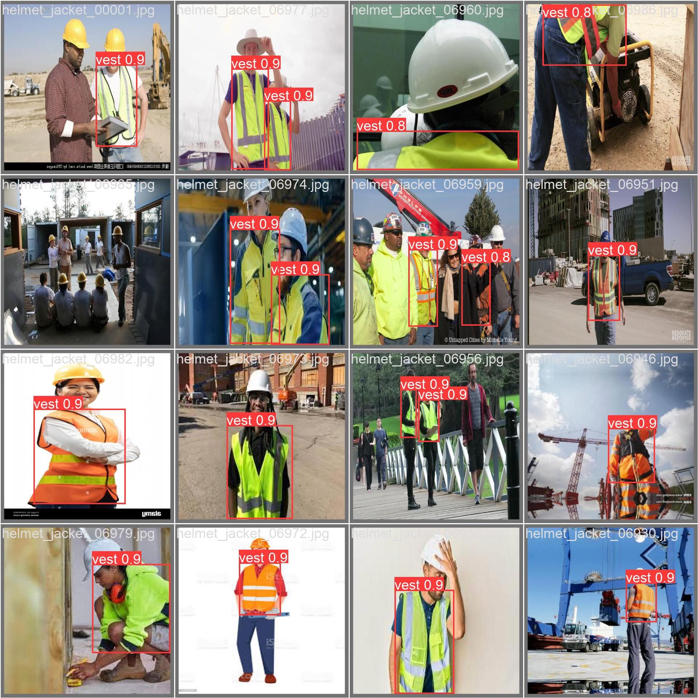

# Reflexive clothing object detection dataset, 8800 images, with annotations, supports VOC and YOL

## Body

Reflexive Clothing Object Detection Dataset, 8800 images, with annotations, supports VOC and YOLOF formats.
The images are all reflexive clothing, suitable for target detection, dataset, model training, etc. The electronic version will be sent directly after purchase. If you need more details, feel free to message me, I am willing to negotiate the price, at any time! (C036)

1. Converting VOCs as needed, and additional charges apply for model training services.

## Images

## Payment

Here is a pay link on Stripe ( https://buy.stripe.com/3cs8yP7sY87d0vu9AB ). Please contact me lonlonago@foxmail.com after funding $89, and I will send you a complete data files , thank you!

